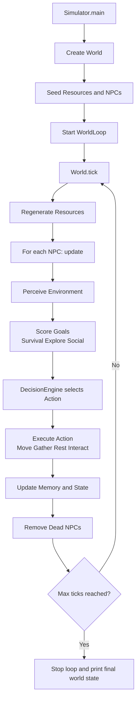

# EcoSim

EcoSim is a Java-based NPC simulation where autonomous agents pursue survival, exploration, and social goals inside a 2D grid world. The simulation runs in ticks and prints behavior logs so you can observe emergent cooperation, competition, and movement patterns.

## What This Project Includes

- Utility-style goal evaluation for each NPC.
- Actions such as move, gather, rest, and interact.
- A world loop with configurable tick interval and max tick count.
- Resource regeneration and spatial queries.
- Memory/impression systems that influence social behavior.

## Tech Stack

- Java 17
- Maven 3.8+

## Prerequisites

1. Install Java 17 (JDK, not JRE).
2. Install Maven.
3. Verify both are available:

```bash
java -version
mvn --version
```

## Quick Start

1. Clone or open the project in VS Code.
2. From the project root, build it once:

```bash
mvn -DskipTests package
```

3. Run the simulator:

```bash
mvn exec:java
```

### Using .env Environment Parameters

The simulator reads settings via environment variables (`System.getenv`), including:

- `ANTHROPIC_API_KEY`
- `ECOSIM_WIDTH`
- `ECOSIM_HEIGHT`
- `ECOSIM_TICK_MS`
- `ECOSIM_MAX_TICKS`
- `ECOSIM_PORT`

Example `.env`:

```bash
ANTHROPIC_API_KEY=your_key_here
ECOSIM_WIDTH=30
ECOSIM_HEIGHT=20
ECOSIM_TICK_MS=250
ECOSIM_MAX_TICKS=0
ECOSIM_PORT=8081
```

Run with `.env` in the current shell:

```bash
set -a; source .env; set +a; mvn exec:java
```

Or use the launcher (it now auto-loads `.env` if present):

```bash
./start.sh
```

You should see a banner, then per-tick logs such as movement, gathering, cooperation, and final world state.

## Build and Run Options

### Run directly with Maven

```bash
mvn exec:java
```

This uses the configured main class: `com.aiworld.Simulator`.

### Build runnable JAR

```bash
mvn clean package
```

Generated artifacts are placed under `target/`, including:

- `ai-npc-world-1.0-SNAPSHOT.jar`
- `ai-npc-world-1.0-SNAPSHOT-jar-with-dependencies.jar`

Run the fat JAR:

```bash
java -jar target/ai-npc-world-1.0-SNAPSHOT-jar-with-dependencies.jar
```

## Initialize and Configure the Current Simulation

The initial world setup is defined in `src/main/java/com/aiworld/Simulator.java`:

- World size (`WORLD_WIDTH`, `WORLD_HEIGHT`)
- Tick settings (`TICK_INTERVAL_MS`, `MAX_TICKS`)
- Initial resource placement and quantities
- Initial NPC spawn positions

To initialize a different scenario, edit those constants and spawn/resource declarations, then rerun:

```bash
mvn exec:java
```

Common setup ideas:

- Resource-scarce world for stronger competition.
- Resource-abundant world for more cooperation.
- Clustered NPC starts for early social interactions.
- Set `MAX_TICKS = 0` for an effectively unbounded run.

## Project Structure

```text
src/main/java/com/aiworld/
	Simulator.java           # Entry point and initial world configuration
	action/                  # NPC actions (move, gather, interact, rest)
	core/                    # World model and simulation loop
	decision/                # Decision logic / action selection
	goal/                    # Goal definitions and scoring
	model/                   # Domain models (location, resource, memory event)
	npc/                     # NPC state, memory, and goal system
```

## Architecture

### High-level Components

- Simulator boots the world, seeds resources/NPCs, and starts the loop.
- WorldLoop advances the simulation on a fixed tick schedule.
- World updates resources and NPCs each tick.
- Each NPC runs perceive -> evaluate goals -> decide action -> act.
- Actions mutate world/NPC state and emit behavior logs.

### Tick Flow Diagram



## Useful Commands

```bash
# Compile only
mvn compile

# Build package (skip tests)
mvn -DskipTests package

# Run simulation
mvn exec:java

# Clean build output
mvn clean
```

## Troubleshooting

- `mvn: command not found`: install Maven and ensure it is on your PATH.
- Java version errors: ensure Java 17 is active.
- If the simulation appears to stop quickly, check `MAX_TICKS` in `Simulator.java`.

## Notes

- Current default run settings are tuned for readable console output.
- Logs are intentionally verbose so behavior over time is easy to inspect.